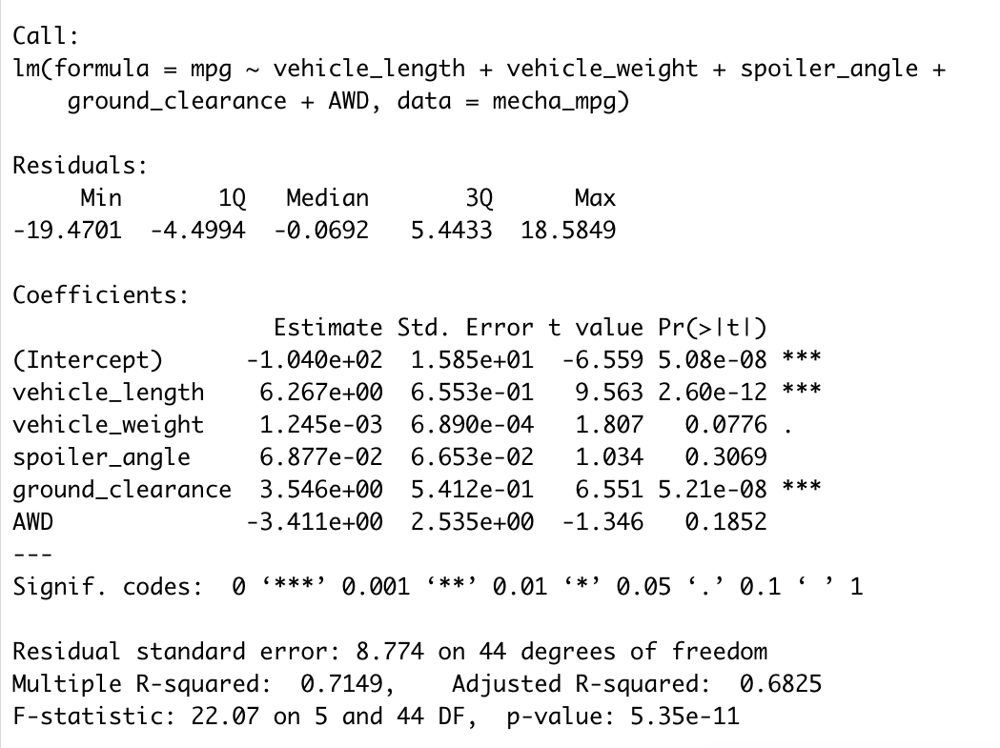
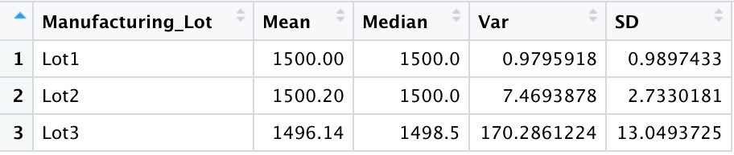
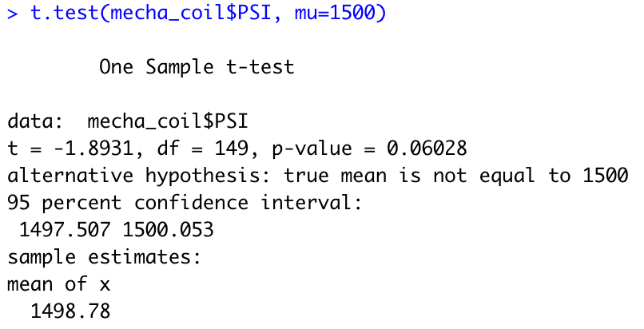
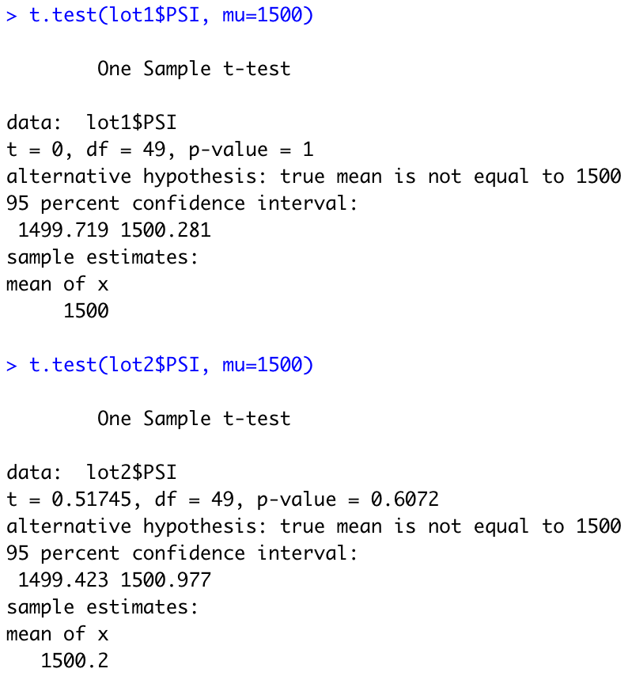
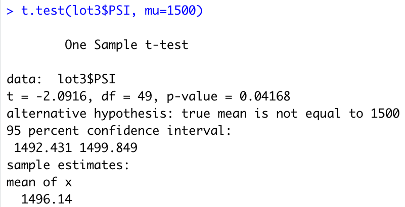

# MechaCar_Statistical_Analysis

## Linear Regression to Predict MPG

* Which variables/coefficients provided a non-random amount of variance to the mpg values in the dataset?
Vehicle length and ground clearance, the linear regression model run on these variables instead figeures for MPG.

* Is the slope of the linear model considered to be zero? Why or why not?
The slope in this model is not consideres zero because of the p-value it could be seen less than 0.05

* Does this linear model predict mpg of MechaCar prototypes effectively? Why or why not?
The r-squared value in this model is 0.7149 which means that this model is 71% accurate so the 71% of the values will be correct. 

## Summary Statistics on Suspension Coils

* The design specifications for the MechaCar suspension coils dictate that the variance of the suspension coils must not exceed 100 pounds per square inch. Does the current manufacturing data meet this design specification for all manufacturing lots in total and each lot individually? Why or why not?

If you look at the image above Lot 1 & Lot 2 accomplish the specification being by less than 100 PSI, Lot 3 has a problem so it is showing a Variance which overpass the limit specification. If we can take the total of lots there will be an acceptance for all the manufactured cars.

## T-Tests on Suspension Coils

At the time that a t.test was performed the results showed the following:

* Lot 1 and Lot 2: Their values are not different from the population mean 1,500 pounds per square inch.  
* Lot 3: The p-value for this lot is 0.04 so it indicates to reject the null hypothesis.

## Study Design: MechaCar vs Competition

* What metric or metrics are you going to test?

* What is the null hypothesis or alternative hypothesis?

* What statistical test would you use to test the hypothesis? And why?

* What data is needed to run the statistical test?

